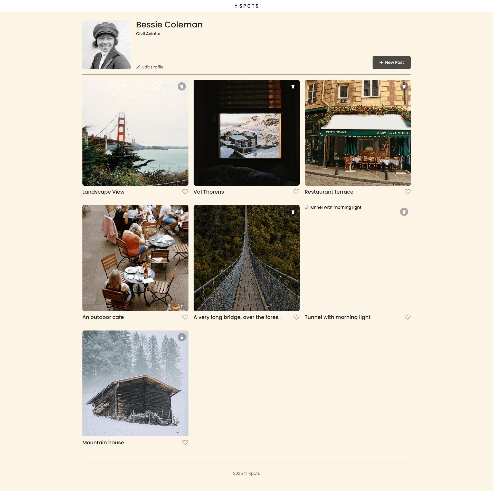

# Project 3: Spots

## Overview

Spots is a responsive webpage that I practice front-end development skills.

### Description

This page displays visual content blocksin a clean, modern layout. Its designed to adapt to different screen sizes using responsive techniques.

#### Technologies Used

HTML — for the structural layout of the webpage
CSS — for styling (fonts, colors, spacing and layouts)
Responsive Design — achieved with Media Queries

### Features

Mobile- friendly layout
Adaptive design for multiple screen sizes
Clean, semantic code structure
Visual content display with consistent styling

### Screenshots

**Intro**

It's a simple project but it helped me understand how to build a basic responsive website.

**Figma**

- [Link to the project on Figma](https://www.figma.com/file/BBNm2bC3lj8QQMHlnqRsga/Sprint-3-Project-%E2%80%94-Spots?type=design&node-id=2%3A60&mode=design&t=afgNFybdorZO6cQo-1)

**Website**
You can clone this project using:
https://onyxempire8282.github.io/se_project_spots/

### Project Walkthrough Video

Here is the walkthrough video for the project:

https://drive.google.com/file/d/141LomcFBG1D408iuhxHcQY3hUBUK5uZk/view?usp=share_link
